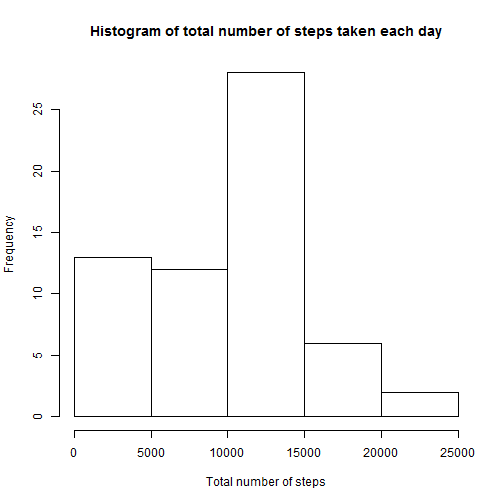
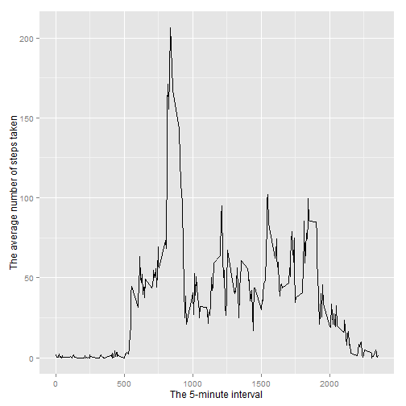
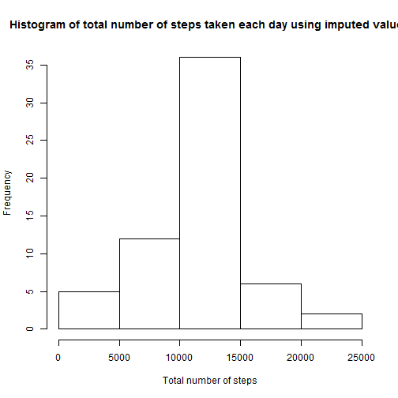

# Reproducible Research: Peer Assessment 1

## Loading and preprocessing the data
Loading data into a data frame 

```r
df <- read.csv( unz("activity.zip", "activity.csv"), 
                header=T, sep=",", 
                colClasses=c("integer","Date","integer"))
```

## What is mean total number of steps taken per day?
Missing values for steps in the data set can be ignored and are therefore removed.

```r
total_steps <- tapply( df$steps, df$date, sum, na.rm=TRUE )
```

Making a histogram of the total number of steps taken each day

```r
hist(total_steps, 
     main="Histogram of total number of steps taken each day",
     xlab="Total number of steps")
```

 

Calculating and reporting the mean and median of the total number of steps taken per day

```r
mean(total_steps)
```

```
## [1] 9354
```

```r
median(total_steps)
```

```
## [1] 10395
```

## What is the average daily activity pattern?
Making a time series plot of the 5-minute interval and the average number of steps taken, 
averaged across all days


```r
library(ggplot2)
average_steps <- aggregate(x=list(steps=df$steps), 
                      by=list(interval=df$interval),
                      FUN=mean, 
                      na.rm=TRUE)
ggplot(data=average_steps, 
       aes(x=interval, y=steps)) +
       geom_line() +
       xlab("The 5-minute interval") +
       ylab("The average number of steps taken")
```

 

Determining the 5-minute interval that on contains the maximum number of steps

```r
average_steps[which.max(average_steps$steps),]
```

```
##     interval steps
## 104      835 206.2
```


## Imputing missing values
Calculating the total number of missing values in the dataset 

```r
sum(is.na(df$steps))
```

```
## [1] 2304
```
Creating a new dataset that is equal to the original dataset but with the missing data filled in.
(filling in all of the missing values in the dataset using the mean for that 5-minute interval)

```r
fill.value <- function(steps, interval) {
    filled <- NA
    if (!is.na(steps))
        filled <- c(steps)
    else
        filled <- (average_steps[average_steps$interval==interval, "steps"])
    return(filled)
}
new_df <- df
new_df$steps <- mapply(fill.value, filled.df$steps, filled.df$interval)
```
  
Making a histogram of the total number of steps taken each day

```r
new_total_steps <- tapply( new_df$steps, new_df$date, sum, na.rm=TRUE )
hist(new_total_steps, 
     main="Histogram of total number of steps taken each day using imputed values",
     xlab="Total number of steps")
```

 

Calculate and report the mean and median total number of steps taken per day
using imputed values. 

```r
mean(new_total_steps)
```

```
## [1] 10766
```

```r
median(new_total_steps)
```

```
## [1] 10766
```

The mean and the median values for the total daily number of steps are larger 
when missing values are imputed.
 

## Are there differences in activity patterns between weekdays and weekends?

```r
# Change to English
  hide <- Sys.setlocale("LC_ALL", "English")

# Function to determine which group the day belongs to
weekday_weekend <- function(date) {
    day <- weekdays(date)
    if (day %in% c("Monday", "Tuesday", "Wednesday", "Thursday", "Friday"))
        return("weekday")
    else if (day %in% c("Saturday", "Sunday"))
        return("weekend")
    else
        stop("invalid date")
}

new_df$day <- sapply(new_df$date, FUN=weekday_weekend)

average_steps <- aggregate(steps ~ interval + day, 
                           data=new_df, 
                            mean)
average_steps <- transform(average_steps, day = factor(day))

library(lattice)
xyplot(steps ~ interval | day, 
       data = average_steps, 
       layout = c(1, 2),
       xlab = "Interval",
       ylab = "Number of steps",
       type = c("l")
       )
```

 
